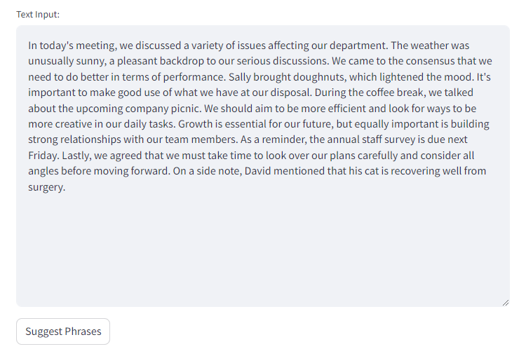
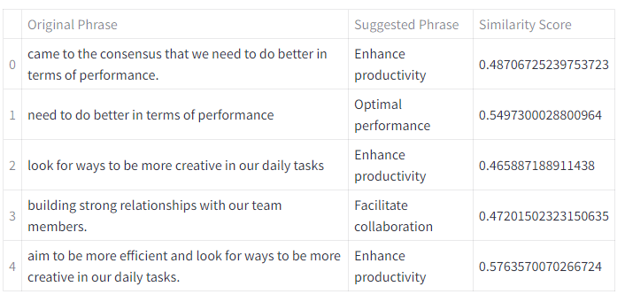

# Text Improvement Engine

Objective is to develop a tool that analyses a given text and suggests improvements based on the similarity to a list of "standardised" phrases. These standardised phrases represent the ideal way certain concepts should be articulated, and the tool should recommend changes to align the input text closer to these standards.

## Usage

I used Streamlit to host the app. You can go to the following url and test it yourself.
```https://text-improvement-ueurzml38vnfggb8tcrw2z.streamlit.app/```
If that does not work follow the instructions below.
First, clone the project. Then, if necessary, create a virtual environment and install all the requirements with

```
$ pip install -r requirements.txt
```
After installing all the libraries run the streamlit service with

```
$ streamlit run app.py
```
You will see the following screen with the deafult input text.



When you press "Suggest Phrase" button it gives you suggestion in the form of a table.


## Approach

I approached the problem as a symmetric semantic search, beacuse the length of the query and the result should be almost the same.
For this I used symmetric model from sentence-transformers library. The solution includes getting embedding representation of the query and chunks of input text then compare them with cosine similarity.

## Code

First we import neccesary libraries

```python
from sentence_transformers import SentenceTransformer
import spacy
from sklearn.metrics.pairwise import cosine_similarity
from spacy.lang.en import stop_words
```
I used spacy library in order to extract phrases of similar length with part of speech[POS] tags. FIrst, with the help of spacy I transformed the text into tokens, then searched the text for verb. After, I used ```[token.i:token.right_edge.i + 1]``` expression to get phrases ranging from the first verb till the rightmost synactic descendants of the verb.
```python
def get_phrases_from_input(input_text : str) -> list:
    spacy_model = spacy.load("en_core_web_lg")
    doc = spacy_model(input_text)
    phrases = []
    for token in doc:
        if token.pos_ in {"VERB"} and token.text.lower() not in stop_words.STOP_WORDS:
            phrase = doc[token.i:token.right_edge.i + 1]
            if len(phrase) > 2 and not all(word.text.lower() in stop_words.STOP_WORDS for word in phrase):
                phrases.append(phrase.text.strip())
    return list(set(phrases))
```

With the help of the function above I was able to extract phrases from the text. The next step is to get embeddings of those phrases and compare them with the embeddings of "standardized" terms.
```python
def compute_similarity(model, phrases, terms, term_embeds, threshold):
    results = []
    for phrase in phrases:
        phrase_embedding = model.encode(phrase).reshape(1, -1)
        similarities = np.array([cosine_similarity(phrase_embedding, term_embedding.reshape(1, -1))[0][0] for term_embedding in term_embeds])
        idx = np.argmax(similarities)
        similarity = similarities[idx]
        if similarity > threshold:
            results.append((phrase, terms[idx], similarity))
    return results
```
The function above encodes phrases and compares them with the "standardized" terms. With the help of ```np.argmax()``` function I retrieved the most similar term with the phrase, and if cosine similarity score of the term greater than the threshold, I added the term to the list in order to give suggestions later.

## Further Improvement
First of all, it would be very useful to visualize the embeddings of both phrases and terms with the help of any dimensionality reduction algorithm like UMAP or tSNE. Then, other embedding models can be tested.